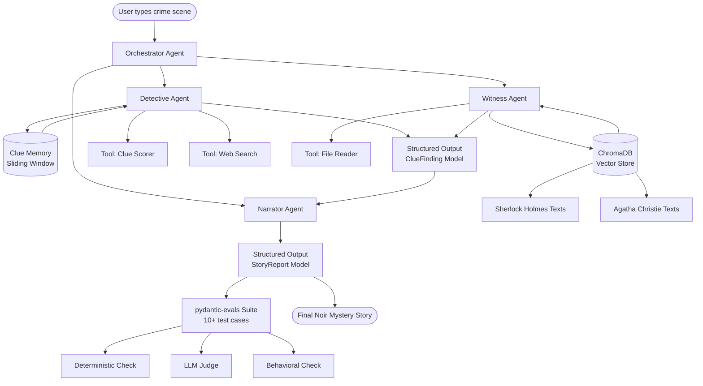

# 🎩 Noir Mystery Story Engine

An agentic AI system that transforms crime scene descriptions into atmospheric noir mystery stories. Built with PydanticAI, ChromaDB, and classic detective literature.

## Architecture



## Setup

**1. Clone the repo**
```bash
git clone https://github.com/NhanNguyen-SG/noir-mystery-engine.git
cd noir-mystery-engine
```

**2. Install dependencies with uv**
```bash
uv sync
```

**3. Set up environment variables**
```bash
cp .env.example .env
```
Then open `.env` and add your course gateway key:
```
OPENAI_API_KEY=your_course_gateway_key_here
OPENAI_BASE_URL=https://litellm.6640.ucf.spencerlyon.com
```

**4. Download the corpus and build the vector store**
```bash
cd corpus
curl -o sherlock_adventures.txt "https://www.gutenberg.org/files/1661/1661-0.txt"
curl -o sherlock_memoirs.txt "https://www.gutenberg.org/files/834/834-0.txt"
curl -o sherlock_return.txt "https://www.gutenberg.org/files/108/108-0.txt"
curl -o mysterious_affair.txt "https://www.gutenberg.org/files/863/863-0.txt"
cd ..
uv run python src/rag/ingest.py
```

## Running the app

### Shiny web interface (recommended)

```bash
uv run shiny run app.py
```

Then open `http://127.0.0.1:8000` in your browser.


Describe a crime scene in the sidebar and click **Begin Investigation**. The agent activity feed shows each step in real time as the Detective, Witness, Analyst, and Narrator agents do their work. The final story appears in the main panel once complete.

### CLI

```bash
uv run main.py
```

```
$ uv run main.py

🎩  NOIR MYSTERY STORY ENGINE  🎩
Where every crime scene tells a story...

Describe your crime scene: A wealthy banker was found dead in his locked study...

🔍 Detective investigating the scene...
📚 Witness retrieving archive context...
📋 Scoring clues by importance...
✍️  Narrator writing the story...

════════════════════════════════════════════════════════════
📖  TITLE:    The Banker's Last Secret
🏛️   SETTING:  A rain-soaked manor, midnight
🔍  CLUES:    5 discovered
🎯  TOP CLUE: Torn letter on the desk
🕵️   SUSPECT:  The Butler
...
```

## Project Structure

```
noir-mystery-engine/
├── src/
│   ├── agents/
│   │   ├── orchestrator.py     # Routes tasks between agents
│   │   ├── detective.py        # Reasons through clues + memory
│   │   ├── witness.py          # Retrieves from RAG corpus
│   │   └── narrator.py         # Writes final story
│   ├── tools/
│   │   ├── clue_scorer.py      # Scores and ranks clues
│   │   ├── web_search.py       # Web search tool
│   │   └── file_reader.py      # File reader tool
│   ├── models/
│   │   ├── clue_finding.py     # ClueFinding Pydantic model
│   │   └── story_report.py     # StoryReport Pydantic model
│   ├── rag/
│   │   ├── ingest.py           # Chunks and embeds corpus
│   │   └── retriever.py        # ChromaDB query wrapper
│   └── evals/
│       └── suite.py            # pydantic-evals test suite
├── corpus/                     # Public domain detective stories
├── overview.ipynb              # End-to-end walkthrough notebook
├── presentation/               # Week 14 slides
├── app.py                      # Shiny web interface
├── main.py                     # CLI entry point
├── front_end.png               # UI screenshot
├── pyproject.toml
├── .env.example
└── README.md
```

## Team

| Name | Contributions |
|------|--------------|
| Nhan | RAG pipeline, Detective agent, Witness agent, Orchestrator, Tools, Narrator agent |
| Khoi | Evaluation suite, CLI, Notebook, Presentation |
| Brent | Tested and reviewed the agent framework, developed front for use in browser|

## AI usage disclosure

Nhan used: Claude Anthopic
Prompts: 
- pending

Khoi used...
- pending

Brent used: Claude Anthropic
Prompts:
- pending

## Course

CAP-6640 — Computational Understanding of Natural Language
University of Central Florida — Spring 2026
