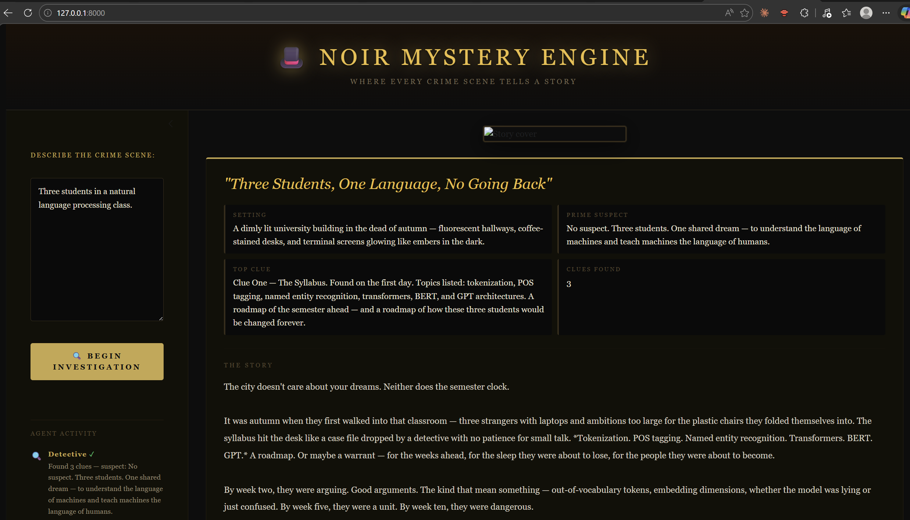
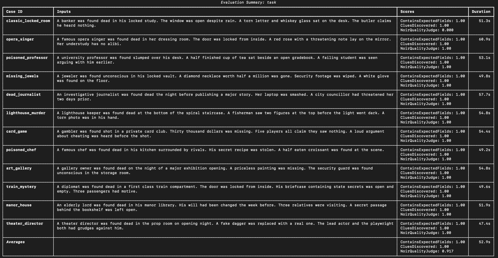

# 🎩 Noir Mystery Story Engine

An agentic AI system that transforms crime scene descriptions into atmospheric noir mystery stories. Built with PydanticAI, ChromaDB, and classic detective literature.

## Architecture


## Setup

**1. Clone the repo**
```bash
git clone https://github.com/NhanNguyen-SG/noir-mystery-engine.git
cd noir-mystery-engine
```

**2. Install dependencies with uv**
```bash
uv sync
```

**3. Set up environment variables**
```bash
cp .env.example .env
```
Then open `.env` and add your course gateway key:
```
OPENAI_API_KEY=your_course_gateway_key_here
OPENAI_BASE_URL=https://litellm.6640.ucf.spencerlyon.com
```

**4. Download the corpus and build the vector store**
```bash
cd corpus
curl -o sherlock_adventures.txt "https://www.gutenberg.org/files/1661/1661-0.txt"
curl -o sherlock_memoirs.txt "https://www.gutenberg.org/files/834/834-0.txt"
curl -o sherlock_return.txt "https://www.gutenberg.org/files/108/108-0.txt"
curl -o mysterious_affair.txt "https://www.gutenberg.org/files/863/863-0.txt"
cd ..
uv run python src/rag/ingest.py
```

## Running the app

### Shiny web interface (recommended)

```bash
uv run shiny run app.py
```

Then open `http://127.0.0.1:8000` in your browser.



Describe a crime scene in the sidebar and click **Begin Investigation**. The agent activity feed shows each step in real time as the Detective, Witness, Analyst, and Narrator agents do their work. The final story appears in the main panel once complete.

### CLI

```bash
uv run main.py
```

```
$ uv run main.py

🎩  NOIR MYSTERY STORY ENGINE  🎩
Where every crime scene tells a story...

Describe your crime scene: A wealthy banker was found dead in his locked study...

🔍 Detective investigating the scene...
📚 Witness retrieving archive context...
📋 Scoring clues by importance...
✍️  Narrator writing the story...

════════════════════════════════════════════════════════════
📖  TITLE:    The Banker's Last Secret
🏛️   SETTING:  A rain-soaked manor, midnight
🔍  CLUES:    5 discovered
🎯  TOP CLUE: Torn letter on the desk
🕵️   SUSPECT:  The Butler
...
```

## Project Structure

```
noir-mystery-engine/
├── src/
│   ├── agents/
│   │   ├── orchestrator.py     # Routes tasks between agents
│   │   ├── detective.py        # Reasons through clues + memory
│   │   ├── witness.py          # Retrieves from RAG corpus
│   │   └── narrator.py         # Writes final story
│   ├── tools/
│   │   ├── clue_scorer.py      # Scores and ranks clues
│   │   ├── web_search.py       # Web search tool
│   │   └── file_reader.py      # File reader tool
│   ├── models/
│   │   ├── clue_finding.py     # ClueFinding Pydantic model
│   │   └── story_report.py     # StoryReport Pydantic model
│   ├── rag/
│   │   ├── ingest.py           # Chunks and embeds corpus
│   │   └── retriever.py        # ChromaDB query wrapper
│   └── evals/
│       └── suite.py            # pydantic-evals test suite
├── corpus/                     # Public domain detective stories
├── overview.ipynb              # End-to-end walkthrough notebook
├── presentation/               # Week 14 slides
├── app.py                      # Shiny web interface
├── main.py                     # CLI entry point
├── front_end.png               # UI screenshot
├── pyproject.toml
├── .env.example
└── README.md
```
## Evaluation



## Team

| Name | Contributions |
|------|--------------|
| Nhan | RAG pipeline, Detective agent, Witness agent, Orchestrator, Tools, Narrator agent |
| Khoi | Evaluation suite, CLI, Notebook, Presentation |
| Brent | Tested and reviewed the agent framework, developed front for use in browser|

## AI usage disclosure

**Nhan used: Claude Anthopic**
- Is my idea too simple for this project?
- What can I do to make it more interested?
- Does my system design make sense to you? any overlapping?
- Is detective doing too many things?
- any idea for 3 tools?
- The websearch is working but it didn't wire to anything, what should I do?
- how do I know if RAG is working?
- is these chunks too small?
- why Witness ignore the retrieved context?
- how can i show memory change behavior?
- idk if this is actually multi agent or just steps in order...?
- is my evaluation too easy?
- debug please
- help me enhance my README
- can you please give me an out line for my overview notebook?

Khoi used : Chat GPT openAI 
- how do i used websearch for this project and how will it affect the code base
- Are my test case interesting enough for and are there any  case that is too strict or not good enough
- I want my AI agent to search throuhghh corpus first before going to web search
-  Give me a modern test case something that is hard and not  invovle with sherlock holmes
-  Can you tell me how to give a cite of what  page that the detective for information
-  How to know if the AI agent are following the step ?
-  How can you check if my prompt for  all of my AI agent is following my logics
-  Print out all of the step that the detective AI has go through
-  Apply web search for my witness AI too and make sure that it look at corpus first before doing web searchhh

Brent used: Claude Anthropic
- What is the architecture of the project
- What are the most obvious way this could be improved
- Are there other similar tools like this
- Create a Shiny python application that uses the main program as a backend
- Update the app to have a consistant and user friendly interface
- Add a image generation step after the initial story is formed
- Remove the image generation feature

## Course

CAP-6640 — Computational Understanding of Natural Language
University of Central Florida — Spring 2026
